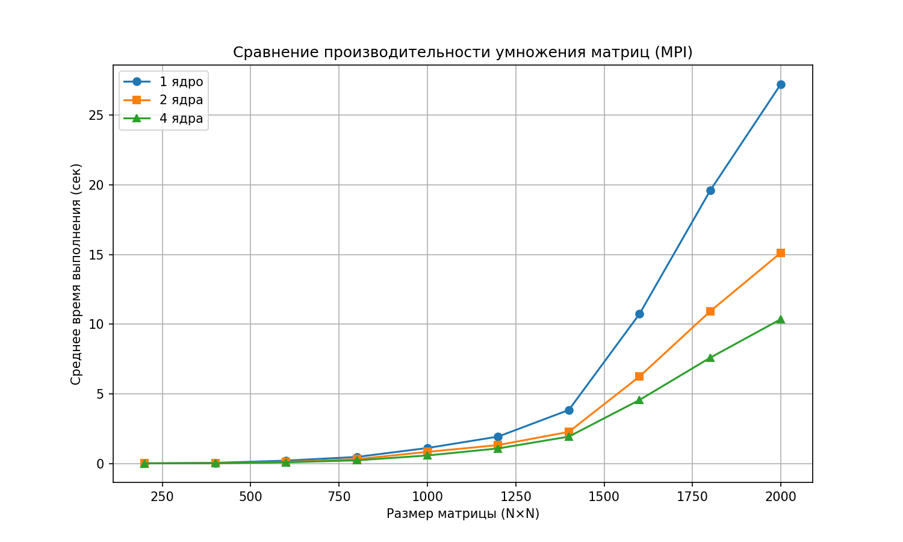

# parallel_prog
Лабораторные работы по параллельному программированию 3 курс
# Сравнение производительности умножения матриц на MPI

## Описание
В отчете представлены результаты тестирования умножения квадратных матриц различного размера с использованием технологии MPI (Message Passing Interface) на разном количестве ядер (1, 2, 4).  
Измерялось среднее время выполнения (в секундах) для матриц размером от 200×200 до 2000×2000 с шагом 200.

## Результаты

| Размер матрицы | 1 ядро (сек) | 2 ядра (сек) | 4 ядра (сек) |
|----------------|--------------|--------------|--------------|
| 200×200        | 0.003767     | 0.002339     | 0.001617     |
| 400×400        | 0.042473     | 0.021318     | 0.014597     |
| 600×600        | 0.201786     | 0.107206     | 0.083335     |
| 800×800        | 0.466137     | 0.308212     | 0.222291     |
| 1000×1000      | 1.106542     | 0.830098     | 0.572252     |
| 1200×1200      | 1.927065     | 1.317510     | 1.077434     |
| 1400×1400      | 3.838730     | 2.265218     | 1.925212     |
| 1600×1600      | 10.733880    | 6.239444     | 4.556290     |
| 1800×1800      | 19.593200    | 10.924200    | 7.590832     |
| 2000×2000      | 27.242110    | 15.131720    | 10.361481    |

## График зависимости времени выполнения от размера матрицы

## Выводы

- Увеличение числа ядер значительно ускоряет вычисления, особенно на больших матрицах.
- При переходе с 1 ядра на 2 ядра ускорение на матрице 2000×2000 составляет ~44% (27.24 → 15.13 сек).
- При переходе с 2 ядер на 4 ядра дополнительное ускорение на той же матрице — ~31% (15.13 → 10.36 сек).
- Эффективность распараллеливания снижается с ростом числа ядер из-за накладных расходов на коммуникацию, но остаётся значительной.
