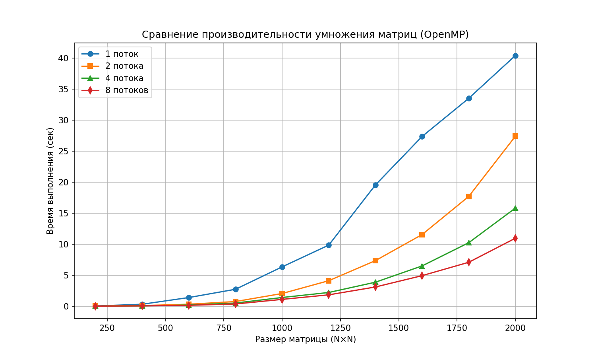

# parallel_prog
Лабораторные работы по параллельному программированию 3 курс

# Сравнение производительности умножения матриц на OpenMP

## Описание
В отчете представлены результаты тестирования умножения квадратных матриц различного размера с использованием технологии OpenMP на разном количестве потоков (1, 2, 4, 8).  
Измерялось время выполнения (в секундах) для матриц размером от 200×200 до 2000×2000 с шагом 200.

## Результаты

| Размер матрицы | 1 поток (сек) | 2 потока (сек) | 4 потока (сек) | 8 потоков (сек) |
|----------------|---------------|----------------|----------------|-----------------|
| 200×200        | 0.019925      | 0.008106       | 0.005013       | 0.004357        |
| 400×400        | 0.303081      | 0.087937       | 0.047896       | 0.037407        |
| 600×600        | 1.382384      | 0.305644       | 0.175166       | 0.128545        |
| 800×800        | 2.713783      | 0.737191       | 0.497628       | 0.345142        |
| 1000×1000      | 6.324125      | 2.032522       | 1.388501       | 1.088100        |
| 1200×1200      | 9.835248      | 4.096167       | 2.196980       | 1.819352        |
| 1400×1400      | 19.528620     | 7.333350       | 3.853662       | 3.084355        |
| 1600×1600      | 27.340330     | 11.531460      | 6.478134       | 4.910651        |
| 1800×1800      | 33.489950     | 17.678450      | 10.220124      | 7.065587        |
| 2000×2000      | 40.391770     | 27.382730      | 15.802310      | 10.943949       |

## График зависимости времени выполнения от размера матрицы

## Выводы

- Увеличение числа потоков значительно сокращает время вычислений, особенно на больших матрицах.
- На матрице 2000×2000 ускорение при использовании 8 потоков относительно 1 потока составляет почти **3.7 раза** (40.39 → 10.94 сек).
- Переход с 2 на 4 потока даёт выигрыш около 42% на матрице 2000×2000 (27.38 → 15.80 сек), а с 4 на 8 потоков — ещё 31% (15.80 → 10.94 сек).
