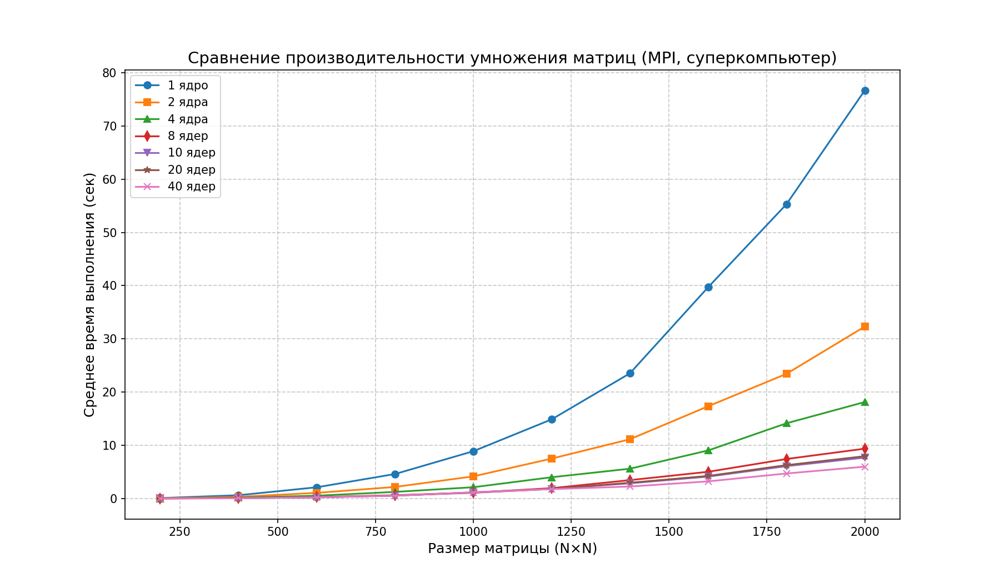

# parallel_prog
Лабораторные работы по параллельному программированию 3 курс

## Сравнение производительности умножения матриц на MPI (суперкомпьютер)

## Описание
В отчете представлены результаты тестирования умножения квадратных матриц различного размера с использованием технологии MPI (Message Passing Interface) на **1, 2, 4, 8, 10, 20 и 40 ядрах**.  
Измерялось среднее время выполнения (в секундах) для матриц размером от 200×200 до 2000×2000 с шагом 200.

## Процесс выполнения

## Результаты

| Размер матрицы | 1 ядро (сек) | 2 ядра (сек) | 4 ядра (сек) | 8 ядер (сек) | 10 ядер (сек) | 20 ядер (сек) | 40 ядер (сек) |
|----------------|--------------|--------------|--------------|--------------|---------------|---------------|---------------|
| 200×200        | 0.074642     | 0.037676     | 0.018046     | 0.008965     | 0.007184      | 0.003591      | 0.001819      |
| 400×400        | 0.612147     | 0.305850     | 0.153605     | 0.076662     | 0.061124      | 0.052634      | 0.032630      |
| 600×600        | 2.103970     | 1.057500     | 0.521325     | 0.264661     | 0.212231      | 0.220271      | 0.222681      |
| 800×800        | 4.598340     | 2.166110     | 1.237210     | 0.607275     | 0.513949      | 0.556473      | 0.535464      |
| 1000×1000      | 8.884030     | 4.155120     | 2.116130     | 1.107710     | 1.166320      | 1.075970      | 1.147490      |
| 1200×1200      | 14.864500    | 7.491850     | 3.990710     | 1.936880     | 1.800000      | 1.790260      | 1.761060      |
| 1400×1400      | 23.521300    | 11.130600    | 5.594620     | 3.448370     | 2.847340      | 2.953150      | 2.246880      |
| 1600×1600      | 39.717300    | 17.332000    | 9.028340     | 5.016800     | 4.107380      | 4.241810      | 3.213340      |
| 1800×1800      | 55.307100    | 23.428700    | 14.130900    | 7.419770     | 6.070140      | 6.264750      | 4.699860      |
| 2000×2000      | 76.699000    | 32.304400    | 18.126500    | 9.362200     | 7.672390      | 7.947600      | 5.974690      |

## График зависимости времени выполнения от размера матрицы

## Выводы

- Увеличение числа ядер значительно сокращает время вычислений, особенно на больших матрицах.
- На матрице 2000×2000 ускорение при использовании 40 ядер относительно 1 ядра составляет почти 12.8 раза (76.70 → 5.97 сек).
- При переходе с 8 на 10 ядер время на 2000×2000 снижается с 9.36 до 7.67 сек (ускорение ~18%), но с 10 до 20 ядер улучшение минимально (7.67 → 7.95 сек — даже небольшое замедление), что говорит о насыщении из-за накладных расходов на коммуникацию.
- Наибольший эффект от распараллеливания наблюдается для матриц от 800×800 и выше.
