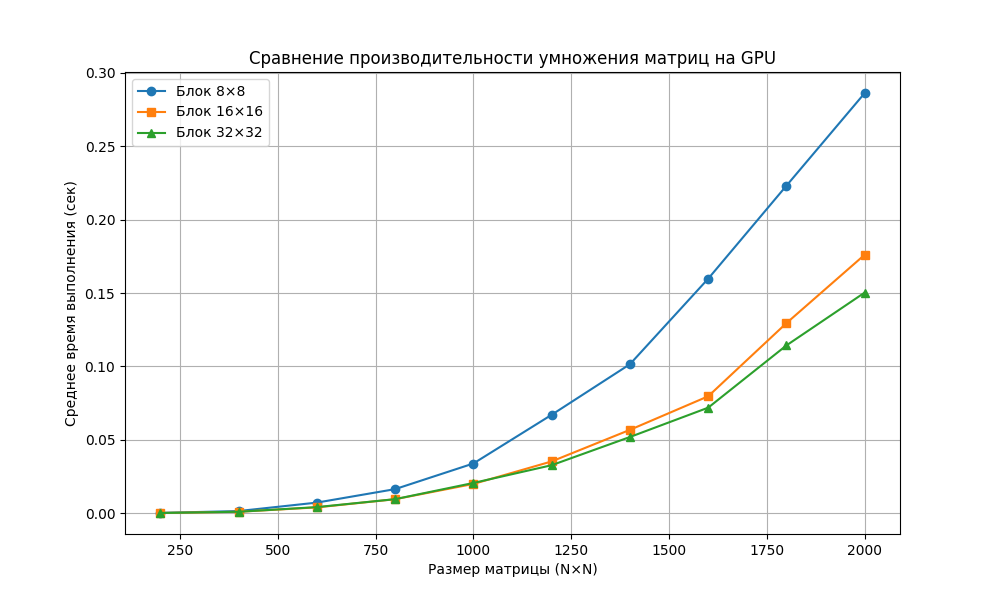

# parallel_prog
Лабораторные работы по параллельному программированию 3 курс
# Сравнение производительности умножения матриц на GPU (CUDA)

## Описание
В отчете представлены результаты тестирования умножения квадратных матриц различного размера на GPU с использованием трех конфигураций блоков (`8×8`, `16×16`, `32×32`).  
Измерялось среднее время выполнения (в секундах) для каждого размера матрицы.  
Тестирование проводилось на матрицах размером от 200×200 до 2000×2000 с шагом 200.

## Результаты

| Размер матрицы | Блок 8×8 (сек) | Блок 16×16 (сек) | Блок 32×32 (сек) |
|----------------|----------------|------------------|------------------|
| 200×200        | 0.000347        | 0.000283         | 0.000274         |
| 400×400        | 0.001598        | 0.001104         | 0.001114         |
| 600×600        | 0.007346        | 0.004093         | 0.004274         |
| 800×800        | 0.016518        | 0.009648         | 0.009694         |
| 1000×1000      | 0.033963        | 0.020045         | 0.020715         |
| 1200×1200      | 0.067117        | 0.035375         | 0.032802         |
| 1400×1400      | 0.101541        | 0.056875         | 0.051999         |
| 1600×1600      | 0.159758        | 0.079725         | 0.071973         |
| 1800×1800      | 0.223091        | 0.129538         | 0.114369         |
| 2000×2000      | 0.286149        | 0.176115         | 0.150355         |

## График зависимости времени выполнения от размера матрицы

## Выводы

- Для небольших матриц (200–400) все конфигурации блоков показывают сопоставимые результаты.
- Начиная с размера 800×800 и выше, конфигурация `16×16` оказывается быстрее `8×8`, а `32×32` — быстрее обеих.
- Наибольшее преимущество использования блока `32×32` наблюдается на матрице 2000×2000:  
  `32×32` быстрее `16×16` на ~15% и быстрее `8×8` на ~47%.
