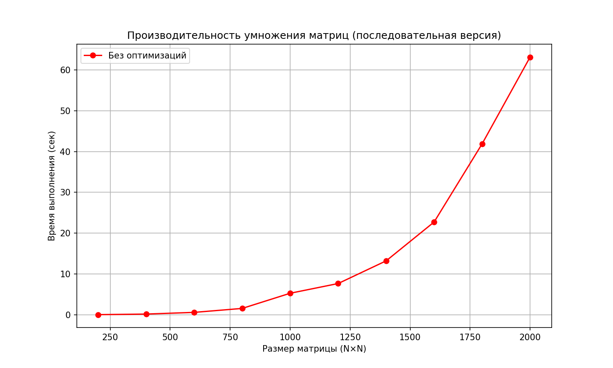

# parallel_prog
Лабораторные работы по параллельному программированию 3 курс

# Производительность умножения матриц (без оптимизаций)

## Описание
В отчете представлены результаты тестирования умножения квадратных матриц различного размера в **последовательной версии** (без использования параллельных технологий).  
Измерялось время выполнения (в секундах) для матриц размером от 200×200 до 2000×2000 с шагом 200.

## Результаты

| Размер матрицы | Время выполнения (сек) |
|----------------|------------------------|
| 200×200        | 0.016175               |
| 400×400        | 0.156605               |
| 600×600        | 0.570958               |
| 800×800        | 1.540679               |
| 1000×1000      | 5.261185               |
| 1200×1200      | 7.645517               |
| 1400×1400      | 13.204700              |
| 1600×1600      | 22.734330              |
| 1800×1800      | 41.898300              |
| 2000×2000      | 63.181370              |

## График зависимости времени выполнения от размера матрицы

## Выводы

- Время выполнения резко возрастает с увеличением размера матрицы из-за алгоритмической сложности O(N³).
- Переход с 1000×1000 до 2000×2000 (рост размера в 2 раза) увеличивает время более чем в 12 раз (5.26 → 63.18 сек), что соответствует кубическому росту.
